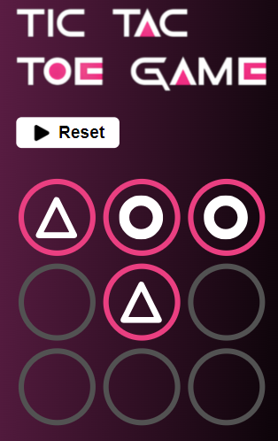

# 🎮 Juego Ta-Te-Ti (Tres en línea) con React

¡Bienvenido al Juego Ta-Te-Ti desarrollado con React! 

Este es un proyecto que te permite disfrutar del clásico juego ta-te-ti en tu navegador. Experimenta la emoción de este juego de estrategia mientras compites contra la inteligencia artificial o desafías a tus amigos en partidas multijugador de manera local.

## Cómo jugar

1. Clona este repositorio a tu máquina local.
2. Abre una terminal en la carpeta raíz del proyecto y ejecuta `npm install` para instalar las dependencias.
3. Luego, ejecuta `npm start` para iniciar el juego en tu navegador.
4. Selecciona el nivel de dificultad o elige el modo multijugador para comenzar a jugar.
5. ¡Diviértete y disfruta de tu partida de ta-te-ti!

